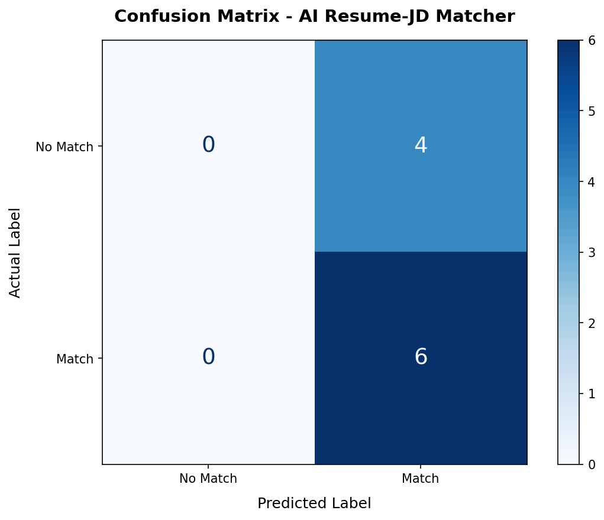
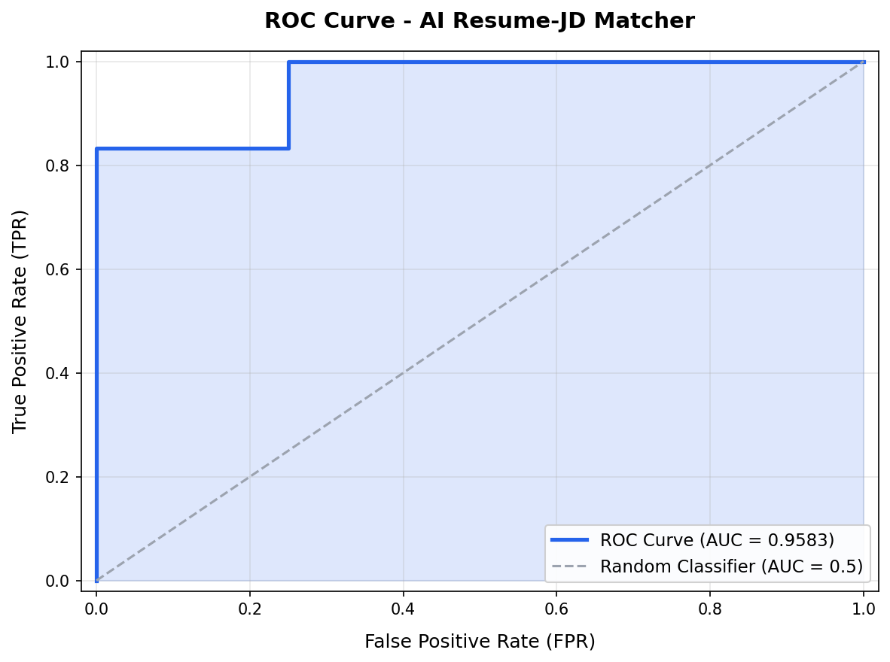

## Model Evaluation

### Overview

The AI Resume-JD Matcher model is evaluated as a binary classifier to determine whether a resume is a **Good Match (1)** or **Poor Match (0)** for a given Job Description.

The model uses **sentence embeddings** from `all-MiniLM-L6-v2` (HuggingFace) and **cosine similarity** to compute a match score, which is then thresholded to produce a binary prediction.

---

### Dataset

- **Dataset Size**: 10 manually labeled Resume–JD pairs
- **Positive Samples (Good Match)**: Pairs where the resume domain aligns with the JD
- **Negative Samples (Poor Match)**: Pairs where the resume domain does NOT align with the JD

---

### Results

| Metric      | Value     |
|-------------|-----------|
| Threshold   | 70%     |
| Accuracy    | 60%  |
| Precision   | 60%  |
| Recall      | 100%  |
| F1 Score    | 75%  |

---

### Best Threshold (from Experiment)

| Recommended Threshold | Best F1 Score |
|----------------------|---------------|
| 75%                  | 83.33%         |

---

### Confusion Matrix



---

### ROC Curve



---

### How to Run

```bash
# 1. Generate sample resumes (one-time)
node evaluation/create_sample_resumes.js

# 2. Run evaluation with default threshold (70%)
node evaluation/evaluate.js

# 3. Run with custom threshold
node evaluation/evaluate.js --threshold=60
```

---

### File Structure

```
evaluation/
├── resumes/               # Resume PDF files
├── jds/                   # Job Description text files
├── labels.csv             # Ground truth labels (resume, jd, label)
├── evaluate.js            # Main evaluation script
├── generate_plots.py      # Confusion matrix + ROC curve generator
├── create_sample_resumes.js  # Sample PDF generator
├── results.csv            # Generated evaluation results
├── confusion_matrix.png   # Generated confusion matrix image
├── roc_curve.png          # Generated ROC curve image
└── EVALUATION.md          # This documentation
```

---

### Notes

- The evaluation pipeline **reuses** the same `extractText`, `getEmbedding`, and `cosineSimilarity` functions from the production backend — no algorithm was rewritten.
- Replace the sample resume-JD pairs with real data for meaningful evaluation results.
- The HuggingFace API has rate limits — a 1.5s delay is added between API calls.
